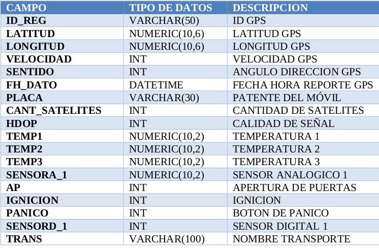

Library to consume qanalytics API services (https://www.qanalytics.cl)

Install:

```bash
pip3 install qanalytics_python
```

For example

To consume the service "Webservices QMGPS"
- endpoint: "/gps_test/service.asmx"
- method: "WM_INS_REPORTE_PUNTO_A_PUNTO"  
- params:



```python
from datetime import datetime

from qanalytics_python.qanalytics import QAnalytics

qa_client = QAnalytics("WS_test", "$$WS17")
data = {
    "ID_REG": "test",
    "LATITUD": -32.1212,
    "LONGITUD": -72.551,
    "VELOCIDAD": 0,
    "SENTIDO": 0,
    "FH_DATO": datetime.strptime("2019-12-27 08:23:50", '%Y-%m-%d %H:%M:%S'),
    "PLACA": "TEST",
    "CANT_SATELITES": 1,
    "HDOP": 1,
    "TEMP1": 999,
    "TEMP2": 999,
    "TEMP3": 999,
    "SENSORA_1": -1,
    "AP": -1,
    "IGNICION": -1,
    "PANICO": -1,
    "SENSORD_1": -1,
    "TRANS": "TEST",
}
resp = qa_client.send_request(data, "/gps_test/service.asmx", "WM_INS_REPORTE_PUNTO_A_PUNTO")
print(f"response code: {resp.code.name}")
print(f"response text: {resp.text}")
print(f"response code: {resp.http_code}")
```

Note that for fields of type "DATETIME" you must pass an object of type "datetime.datetime" as a parameter.

Conversion Example:

```python
date_str = "2019-12-27 08:23:50"
datetime.strptime(date_str, '%Y-%m-%d %H:%M:%S')
```